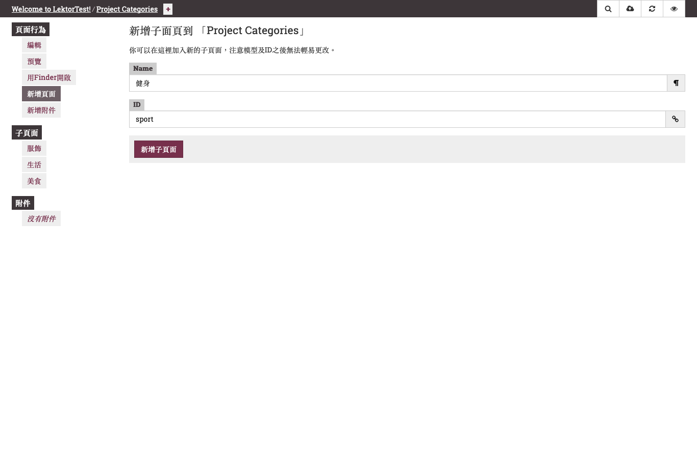
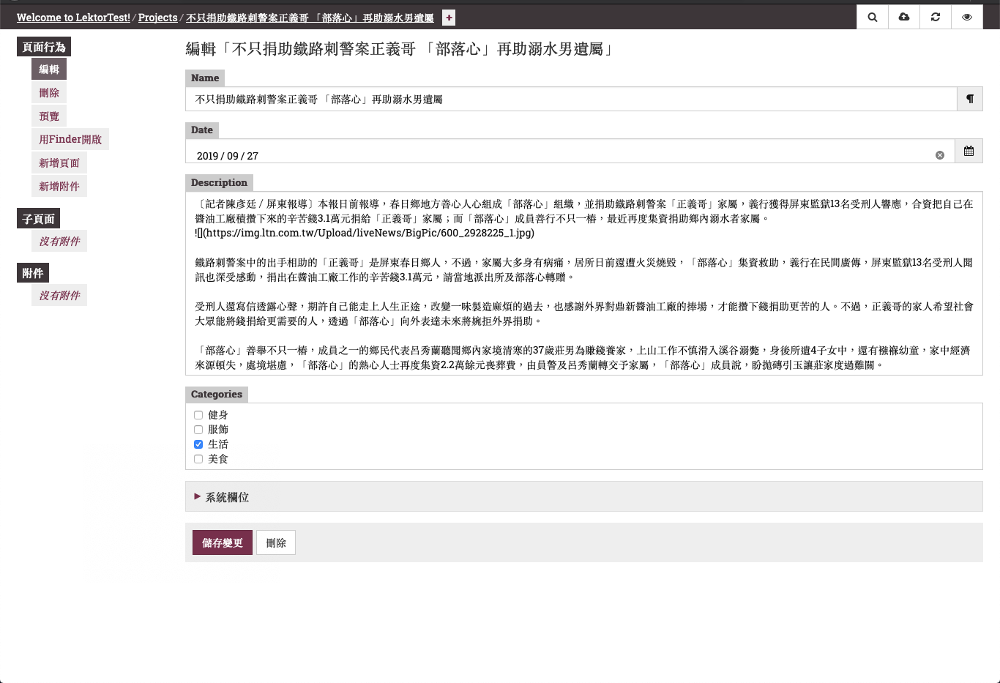
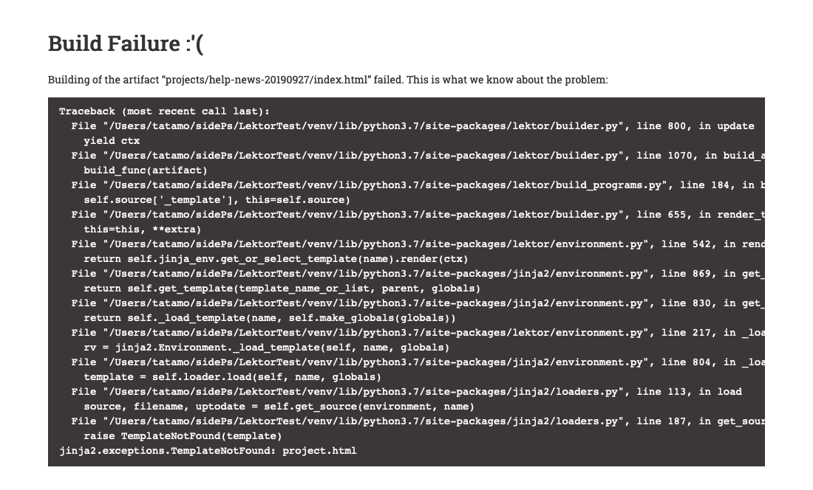
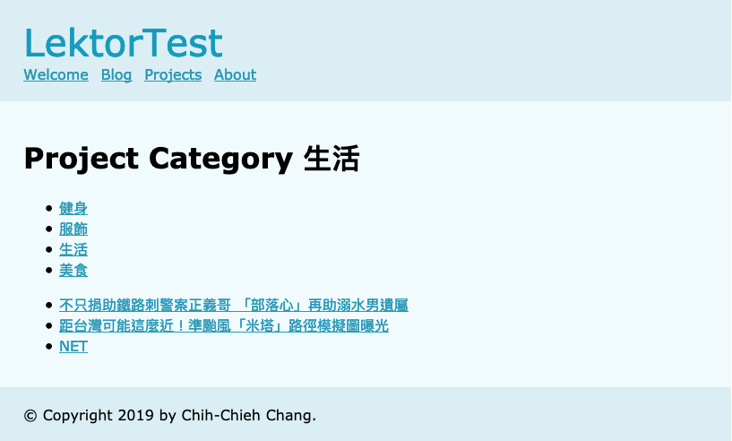

# 分類秘笈，再頑強的資料都會乖乖坐好 ！

在部落格文章或是一些技術文章、資料都會有分類或是篩選的功能，目的是將資料目標集中化，顯示同一類型的資訊，也有點像標籤的功能。本篇文章將帶你按照官網文件完成基本的分類功能建置，並進行說明。

## 建立Model

在官網說明文件中，將資料分成2個部分，1個為專案管理(`Projects`)1個為類別管理(`Categories`)。專案管理底下有各個專案(`project`)，類別管理底下有各個類別(`category`)。所以在建置model的時候，要考慮到建立專案與類別的model，以及各自子層級的model，像之前的blog一樣，有blog與blog-post。4個檔案各自命名為`projects.ini`、`project.ini`、`project-categories.ini`及`project-category.ini`。

### projects.ini

```ini
[model]
name = Projects
label = Projects
hidden = yes
protected = yes

[children]
model = project
order_by = -date, name
```

### project.ini

```ini
[model]
name = Project
label = {{ this.name }}
hidden = yes

[fields.name]
label = Name
type = string

[fields.date]
label = Date
type = date

[fields.description]
label = Description
type = markdown

[fields.categories]
label = Categories
type = checkboxes
source = site.query('/project-categories')
```

### project-categories.ini

```ini
[model]
name = Project Categories
label = Project Categories
hidden = yes
protected = yes

[children]
model = project-category
order_by = name
```

### project-category.ini

```ini
[model]
name = Project Category
label = {{ this.name }}
hidden = yes

[children]
replaced_with = site.query('/projects').filter(F.categories.contains(this))

[fields.name]
label = Name
type = string
```

這裡有一個`replaced_with`，告訴lektor忽略之前的設定，取代只有此類別的project。

## Contents

完成model設定後，可建立contents，讓`projects.ini`、`project.ini`、`project-categories.ini`及`project-category.ini`可以被lektor讀取到網頁。

### projects/contents.lr

```
_model: projects
```

### project-categories/contents.lr

```
_model: project-categories
---
_slug: projects/categories
```

這邊的設定，讓`project-categories/`變成`projects/categories/`。所以如果在`project-categories`中新增`foo`，其路徑會變成`projects/categories/foo/`。

## 建立類別

此時可以先進入後台編輯建立類別。進入`project-categories`並新增頁面，在Name輸入。因ID只支援英文，若輸入中文，ID需再手動輸入，如果Name輸入英文，ID則會自動產生。包含新增的項目，我總共建立了4個類別：



建完之後，可以再建立project資料，我上網找了一些最近的新文及網路文章，並建立頁面。這邊要注意的是ID不支援中文，所以如果name是中文的話，也要給她一個ID。此時可以發現在下面的`Categories`出現剛剛建立的4個類別。



儲存之後你會發現，怎麼專案跟類別儲存後都出現錯誤？別擔心，那是因為你還沒建立templates。



## Template

要來做門面了！

### projects.html

```html


Projects

  <h1>Projects</h1>
  {{ render_category_nav(active=none) }}
  {{ render_project_list(this.children) }}

```

### project.html

```html

{{ this.name }}

  <h1>{{ this.name }}</h1>
  <div class="description">{{ this.description }}</div>

```

### project-categories.html

```html


Project Categories

  <h1>Project Categories</h1>
  {{ render_category_nav(active=none) }}

```

### project-category.html

```html


Project Category {{ this.name }}

  <h1>Project Category {{ this.name }}</h1>
  {{ render_category_nav(active=this._id) }}
  {{ render_project_list(this.children) }}

```

### macros/projects.html

```html

  <ul>
  
    <li class="active"><a href="{{ category|url }}">{{ category.name }}</a></li>
  
  </ul>



  <ul>
  
    <li><a href="{{ project|url }}">{{ project.name }}</a></li>
  
  </ul>

```

## 成果

完成後回到前台畫面，點選`Projects`會出現2個群組，上面那一組為類別，下面那一組則是專案：


下圖為我點`生活`之後出現的畫面，可以看到專案的群組只顯示3項，這3項就是我在建立時有勾選`生活`的文章。



以上就是類別指南的介紹，相信看完這篇後，你也可以將資料整整齊齊地讓他們分類站好了！！

# 團隊系列文

CSScoke - [金魚都能懂的這個網頁畫面怎麼切 - 金魚都能懂了你還怕學不會嗎](https://ithelp.ithome.com.tw/users/20112550/ironman/2623)
King Tzeng - [IoT沒那麼難！新手用JavaScript入門做自己的玩具～](https://ithelp.ithome.com.tw/users/20103130/ironman/2125)
Hina Hina - [陣列大亂鬥](https://ithelp.ithome.com.tw/users/20120000/ironman/2256) 
阿斬 - [Python 程式交易 30 天新手入門](https://ithelp.ithome.com.tw/users/20120536/ironman/2571)
Clarence - [LINE bot 好好玩 30 天玩轉 LINE API](https://ithelp.ithome.com.tw/users/20117701/ironman/2634)
塔塔默 - [用Python開發的網頁不能放到Github上？Lektor說可以！！](https://ithelp.ithome.com.tw/users/20112552/ironman/2735)
Vita Ora - [好 Js 不學嗎 !? JavaScript 入門中的入門。](https://ithelp.ithome.com.tw/users/20112656/ironman/2782)