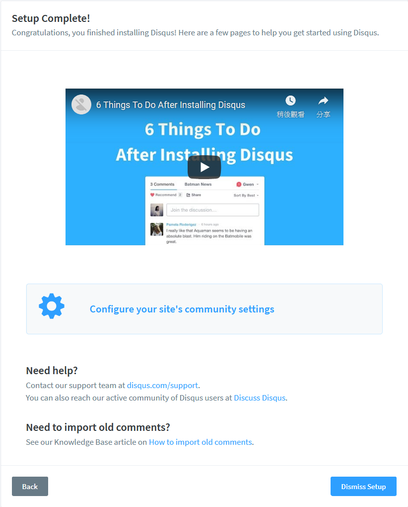
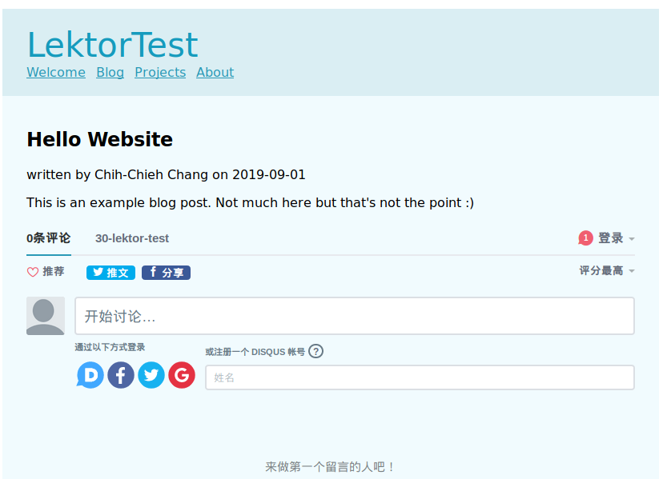

# 加入他，讓你的靜態網頁互動起來!!!

前面[教你如何穿衣服，lektor-theme-nix設定](../lektor/8_lektor-theme-nix設定)中有提到如何在`lektor-theme-nix`主題中使用Disqus功能，本篇將帶你在Lektor網頁中的`任何地方`使用Disqus！

## 設定shortname

`shortname`需要到[DISQUS](https://disqus.com/)中建立專屬資訊，這樣才能將訊息統一管理到你的帳號中。首先在DISQUS註冊(如果還沒有帳號的話)並登入，然後按下`GET STARTED`進入設定。


選擇下面的選項`I want to install Disqus on my site`：


設定基本資訊。其中`Website Name`為唯一的網址，也會是等一下要設定shortname使用的文字。因為下面的圖是我在建立`30-lektor-test`之後重新拍的，disqus找到已經有建立一樣的名稱，就會自動幫你加上編號，所以會看到他給我的會是`30-lektor-test-1`。按下`Create Site`就會進入下一個畫面。


這個畫面要你選擇Disqus安裝的地方，因為Lektor不在選項中，因此選最下面的`I don't see my platform listed, install manually with Universal Code`。


再來會進入教學，但這個教學在lektor中不需要，所以直接拉到最下方，點`Configure`。


可以自行設定其他資訊，若沒有的話就按`Complete Setup`。


然後按下中間的`Configure your site's community settings`。



此時就會看到你的`shortname`，把他複製下來吧!!


## 安裝disqus套件

安裝方法跟前面文章提到的一樣，使用指令安裝：

```
$ lektor plugins add lektor-disqus-comments
```

接下來在專案中新增`config`資料夾，並在資料夾中建立`disqus-comments.ini`，檔案中設定`shortname`，我這邊設定他為`30-lektor-test`：

```ini
shortname = 30-lektor-test
```

## 在任何地方使用Disqus!!

 只要在網頁的任何地方加入以下程式碼，讓Lektor知道你要在這裡使用`render_disqus_comments`函式：

```html
<div class="comments">{{ render_disqus_comments() }}</div>
```

下面是我在blog-post中，文章下方加入disqus功能：

**blog-post.html**

```html


{{ this.title }}

  {{ render_blog_post(this) }}
  <div class="comments">{{ render_disqus_comments() }}</div>

```

此時進入`blog`的`first-post`就會看到下方出現disqus功能。



# 團隊系列文

CSScoke - [金魚都能懂的這個網頁畫面怎麼切 - 金魚都能懂了你還怕學不會嗎](https://ithelp.ithome.com.tw/users/20112550/ironman/2623)
King Tzeng - [IoT沒那麼難！新手用JavaScript入門做自己的玩具～](https://ithelp.ithome.com.tw/users/20103130/ironman/2125)
Hina Hina - [陣列大亂鬥](https://ithelp.ithome.com.tw/users/20120000/ironman/2256) 
阿斬 - [Python 程式交易 30 天新手入門](https://ithelp.ithome.com.tw/users/20120536/ironman/2571)
Clarence - [LINE bot 好好玩 30 天玩轉 LINE API](https://ithelp.ithome.com.tw/users/20117701/ironman/2634)
塔塔默 - [用Python開發的網頁不能放到Github上？Lektor說可以！！](https://ithelp.ithome.com.tw/users/20112552/ironman/2735)
Vita Ora - [好 Js 不學嗎 !? JavaScript 入門中的入門。](https://ithelp.ithome.com.tw/users/20112656/ironman/2782)