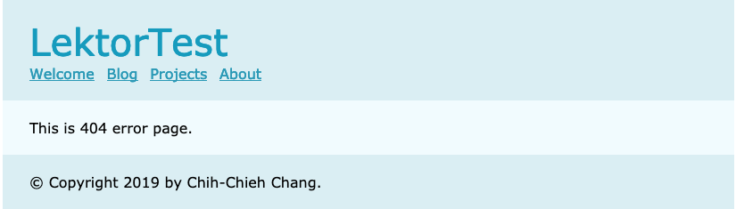

# 404自己做，美到人人想犯錯

我說的是你們不是我!抱歉我的美學不太能見人，但是看完這篇，你就可以做出美到讓人想犯錯，只為求一見的404頁面XD。

## 設定url_style

首先在`.lektorproject`檔案中設定url_style為絕對路徑`absolute`，這樣網址在導向到404的時候才不會出現錯誤的路徑而看不到404畫面。所以`.lektorproject`在沒有其他設定的時候會長這個樣子：

**.lektorproject**

```ini
[project]
name = LektorTest
url_style = absolute
```

## 建立404頁面的連線

要想網站可以連到404畫面，須先設定contents.lr建立連線：

因為預設的model是page.ini，如果沒有特別設定404的model的話，建議將model指向none。

**404.html/contens.lr**

```ini
_model: none
---
_template: 404.html
```

接著只要在template中建立404.html頁面就可以了，是不是很簡單？！！以下為建立簡單404.html參考，你可以考慮沿用layout的版面，或是直接做一個新的頁面。

**404.html**

```html

404 page

This is 404 error page.

```

如此一來404畫面就可以順利出現，來犯個錯吧！



## 伺服器設定

若你要將網頁掛在伺服器上，以下有幾個常見的伺服器設定方式可以做參考：

### Apache

若Apache伺服器有開放`.htaccess`功能，可以在`assets`資料夾裡加入`.htaccess`並輸入下列文字，讓伺服器找到404.html位置。

```
ErrorDocument 404 /404.html
```

### nginx

在nginx config 檔案中，server項目裡加上：

```
error_page 404 /404.html;
```

### Lighttpd

```
server.error-handler-404 = "/404.html"
```

# 團隊系列文

CSScoke - [金魚都能懂的這個網頁畫面怎麼切 - 金魚都能懂了你還怕學不會嗎](https://ithelp.ithome.com.tw/users/20112550/ironman/2623)
King Tzeng - [IoT沒那麼難！新手用JavaScript入門做自己的玩具～](https://ithelp.ithome.com.tw/users/20103130/ironman/2125)
Hina Hina - [陣列大亂鬥](https://ithelp.ithome.com.tw/users/20120000/ironman/2256) 
阿斬 - [Python 程式交易 30 天新手入門](https://ithelp.ithome.com.tw/users/20120536/ironman/2571)
Clarence - [LINE bot 好好玩 30 天玩轉 LINE API](https://ithelp.ithome.com.tw/users/20117701/ironman/2634)
塔塔默 - [用Python開發的網頁不能放到Github上？Lektor說可以！！](https://ithelp.ithome.com.tw/users/20112552/ironman/2735)
Vita Ora - [好 Js 不學嗎 !? JavaScript 入門中的入門。](https://ithelp.ithome.com.tw/users/20112656/ironman/2782)