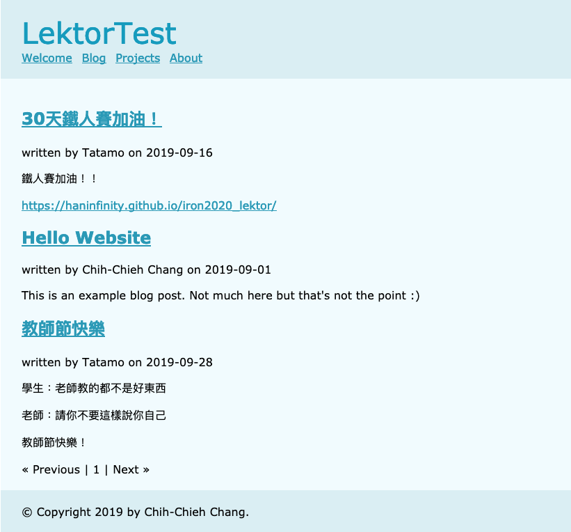
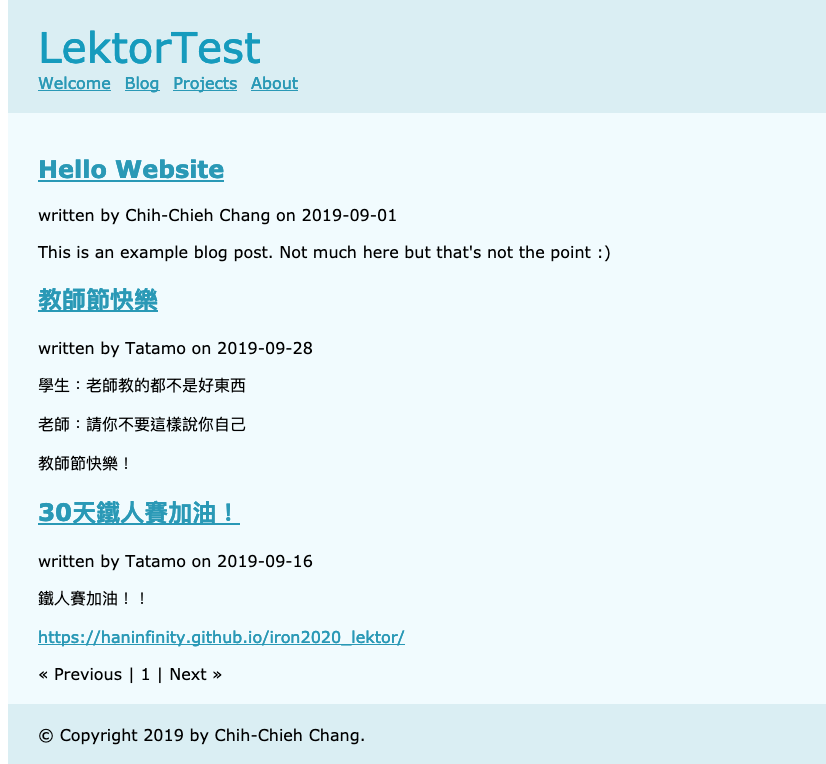

# 想怎麼排，就怎麼排！


在這邊你可以自訂文章或子頁面的排序，下方以Blog為例：

**blog.ini**

```ini
[children]
model = blog-post
order_by = -pub_date, title
```

以上設定以日期為主要排序，標題為次要排序。所以我新增2個文章來看一下排序的結果。


可以看到在日期的設定是`-pub_date`而不是`pub_date`，加負號表示日期是以倒序的方式排列。接下來把`-pub_date`刪掉，只留title排序：

**blog.ini**

```ini
[children]
model = blog-post
order_by = title
```

可以看到排序不一樣了。設定的欄位，只要是blog-post所屬的欄位，都可以設定，像預設的blog-post就有title, author, twitter_handle, pub_date, body可以設定，但也要看他的值是否有可做為排序的內容。



## sort_key

除了用已有的欄位做排序，也可以建立sort_key進行排序。sort_key設定為整數的類型，以下為設定說明。

先在model中建立sort_key欄位：

**blog-post.ini**

```ini
[fields.sort_key]
label = Sort order
type = sort_key
```

設定排序為`sort_key`

**blog.ini**

```ini
[children]
model = doc-page
order_by = sort_key
```

接著在每個文章中設定sort-key

| title            | sort_key |
| ---------------- | -------- |
| Hello Website    | 0        |
| 教師節快樂       | 1        |
| 30天鐵人賽加油！ | 2        |

以Hello Website為例

```ini
title: Hello Website
---
pub_date: 2019-09-01
---
author: Chih-Chieh Chang
---
body:

This is an example blog post.  Not much here but that's not the point :)
---
sort_key:0
```

完成排序如下：



# 團隊系列文

CSScoke - [金魚都能懂的這個網頁畫面怎麼切 - 金魚都能懂了你還怕學不會嗎](https://ithelp.ithome.com.tw/users/20112550/ironman/2623)
King Tzeng - [IoT沒那麼難！新手用JavaScript入門做自己的玩具～](https://ithelp.ithome.com.tw/users/20103130/ironman/2125)
Hina Hina - [陣列大亂鬥](https://ithelp.ithome.com.tw/users/20120000/ironman/2256) 
阿斬 - [Python 程式交易 30 天新手入門](https://ithelp.ithome.com.tw/users/20120536/ironman/2571)
Clarence - [LINE bot 好好玩 30 天玩轉 LINE API](https://ithelp.ithome.com.tw/users/20117701/ironman/2634)
塔塔默 - [用Python開發的網頁不能放到Github上？Lektor說可以！！](https://ithelp.ithome.com.tw/users/20112552/ironman/2735)
Vita Ora - [好 Js 不學嗎 !? JavaScript 入門中的入門。](https://ithelp.ithome.com.tw/users/20112656/ironman/2782)