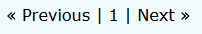
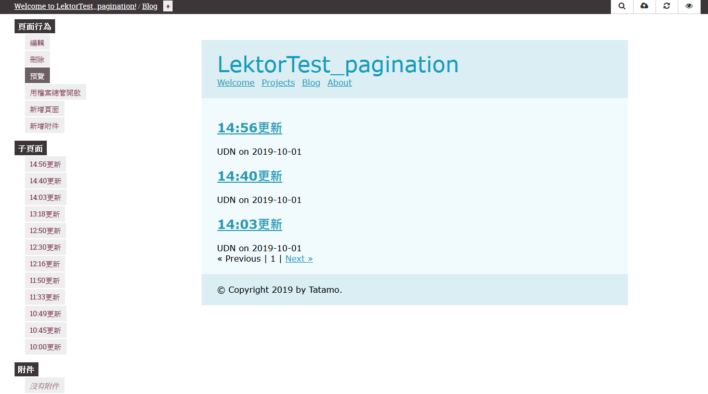

# 分批大法，清單毫秒簡潔清爽!

當你的文章清單過長時，pagination會是你的好朋友，可以幫你將列表分頁，讓畫面更整潔！

## 設定Pagination

以`blog`為例，我們會建立`blog.ini`，管理`blog`底下的文章，並建立`blog-post.ini`，管理每個文章所需要的內容。而`pagination`則是在`blog.ini`中設定：

`per_page = 10`為設定每頁的筆數，可依需求修改數字。

```ini
[pagination]
enabled = yes
per_page = 10

```

## 選擇對應資料

設定完`pagination`後，需要讓頁面只顯示指定的資料(譬如第1頁)，使用方式如下，利用for迴圈進行篩選：

`templates/blog.html`

```jinja2

  ...

```

## 顯示頁碼總覽選項

在macros中建立`pagination.html`檔案，建立頁碼總覽功能，也就是這個



`macros/pagination.html`

```jinja2

  <div class="pagination">
    
      <a href="{{ pagination.prev|url }}">&laquo; Previous</a>
    
      <span class="disabled">&laquo; Previous</span>
    
    | <strong>{{ pagination.page }}</strong> |
    
      <a href="{{ pagination.next|url }}">Next &raquo;</a>
    
      <span class="disabled">Next &raquo;</span>
    
  </div>

```

## 使用macro

在`template/blog.html`中引用macros

```jinja2


  {{ render_pagination(this.pagination) }}

```

## 動手做一次

使用quickstart建立空白專案，並建立models：

**models/blog.ini**

```ini
[model]
name = Blog
label = Blog
hidden = yes

[fields.title]
label = Title
type = string

[children]
model = blog-post
order_by = -pub_date, -title

[pagination]
enabled = yes
per_page = 3
```

**models/blog-post.ini**

```ini
[model]
name = Blog Post
label = {{ this.title }}
hidden = yes

[fields.title]
label = Title
type = string
size = large

[fields.author]
label = Author
type = string
width = 1/2

[fields.twitter_handle]
label = Twitter Handle
type = string
width = 1/4
addon_label = @

[fields.pub_date]
label = Publication date
type = date
width = 1/4

[fields.body]
label = Body
type = markdown
```

建立template

**template/blog.html**

```jinja2


{{ this.title }}

    
    <div class="blog-post">
          <h2><a href="{{ child|url }}">{{ child.title }}</a></h2>
            {{ child.author }} on {{ child.pub_date }}
    </div>
    
    
        {{ render_pagination(this.pagination) }}
    

```

**templates/blog-post.html**

```jinja2

{{ this.title }}

    <div class="blog-post">
        
        <h2><a href="{{ this|url }}">{{ this.title }}</a></h2>
        
        <h2>{{ this.title }}</h2>
        
        <p class="meta">
        written by
        
            <a href="https://twitter.com/{{ this.twitter_handle
            }}">{{ this.author or this.twitter_handle }}</a>
        
            {{ this.author }}
        
        on {{ this.pub_date }}
        </p>
        {{ this.body }}
    </div>

```

在layout中加入blog的項目：

```html
<nav>
    <ul class="nav navbar-nav">
        <li class="active"><a href="{{ '/'|url }}">Welcome</a></li>
        
        <li class="active"><a href="{{ href|url }}">{{ title }}</a></li>
        
    </ul>
</nav>
```

然後進入編輯頁面，先建立blog頁面，然後在blog下建立好幾篇子頁面：

> 今天發生南方澳大橋坍塌事件，引用聯合新聞網的新聞來建立文章


建了10幾篇



可以看到下面有出現選擇頁數的功能，每頁只顯示3筆


修改成5筆試試：

```ini
[pagination]
enabled = yes
per_page = 5
```

成功調整，運行正常!!

不愧是分批大法，清單毫秒簡潔清爽!


# 團隊系列文

CSScoke - [金魚都能懂的這個網頁畫面怎麼切 - 金魚都能懂了你還怕學不會嗎](https://ithelp.ithome.com.tw/users/20112550/ironman/2623)
King Tzeng - [IoT沒那麼難！新手用JavaScript入門做自己的玩具～](https://ithelp.ithome.com.tw/users/20103130/ironman/2125)
Hina Hina - [陣列大亂鬥](https://ithelp.ithome.com.tw/users/20120000/ironman/2256) 
阿斬 - [Python 程式交易 30 天新手入門](https://ithelp.ithome.com.tw/users/20120536/ironman/2571)
Clarence - [LINE bot 好好玩 30 天玩轉 LINE API](https://ithelp.ithome.com.tw/users/20117701/ironman/2634)
塔塔默 - [用Python開發的網頁不能放到Github上？Lektor說可以！！](https://ithelp.ithome.com.tw/users/20112552/ironman/2735)
Vita Ora - [好 Js 不學嗎 !? JavaScript 入門中的入門。](https://ithelp.ithome.com.tw/users/20112656/ironman/2782)