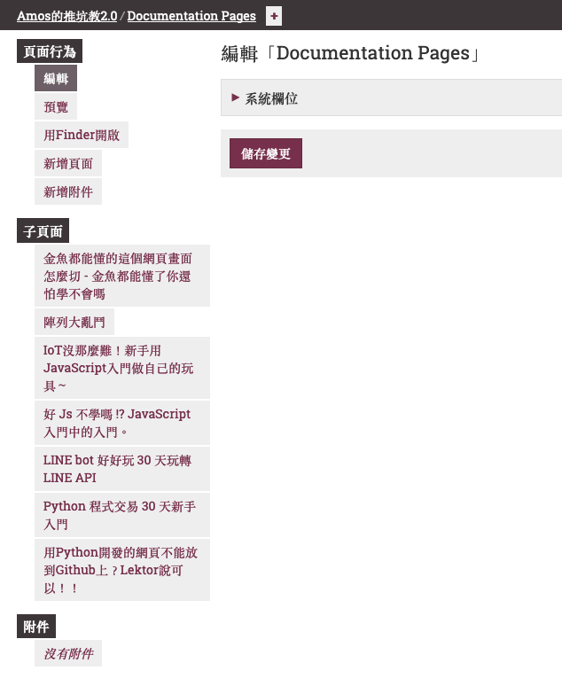
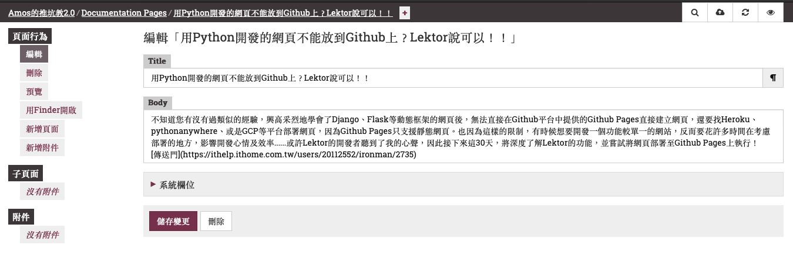
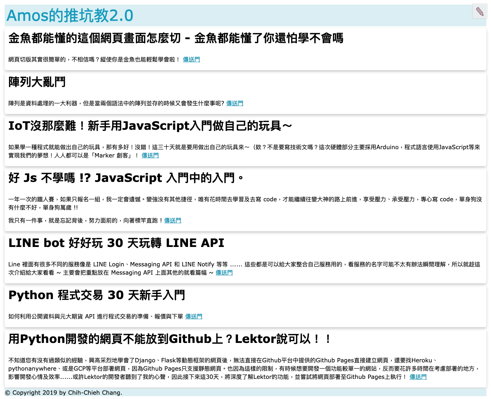

# 我不轉彎唱上癮？Lektor可以讓網頁不轉彎！

「我不轉彎我不我不轉彎我不我不轉彎...」來自盛夏光年的歌詞，有時候網站不希望一直點來點去，讓畫面轉來轉去，是否可以不要網頁轉彎呢？Lektor只說一句：「當然。」，話語中的霸氣不言而喻。

Lektor有一個功能叫做`single-page`，可以將網頁以一頁式的方式看到底。你可能會想那有甚麼，寫網頁直接寫到底就可以啦~我只能說NO NO NO，沒有這麼簡單，文章還是一篇一篇新增，但全部會集中到一頁捲動顯示，寫到這邊我突然想到，`Facebook`就是這樣！以下就來說明設定的步驟吧！

## Models

起手式都是先從model開始，將網頁的架構先建立起來，然後才是template，最後是content。

要建立single-page，需要建立3個model：

1. `index.ini`：管理整個single-page的model。
2. `doc-pages.ini`：官網說這是假的model，主要是將底下的所有頁面都藏起來。
3. `doc-page.ini`：每篇文章的架構model。

**index.ini**

```ini
[model]
name = Documentation
label = {{ this.title }}
hidden = yes
protected = yes

[fields.title]
type = string
```

**doc-pages.ini**

```ini
[model]
name = Documentation Pages
label = Documentation Pages
hidden = yes
protected = yes

[children]
model = doc-page
order_by = _id
```

**doc-page.ini**

```ini
[model]
name = Documentation Page
label = {{ this.title }}
hidden = yes

[fields.title]
type = string

[fields.body]
type = markdown
```

## Template

在template設定，只要設定`index.html`即可(廢話，不然怎麼叫`single-page`)

**templates/index.html**

```html

{{ this.title }}

  
  <header>
    <h1>{{ this.title }}</h1>
    <nav>
      <ul>
        
        <li><a href="#{{ page._id }}">{{ page.title }}</a></li>
        
      </ul>
    </nav>
  </header>
  
    <div class="section" id="{{ page._id }}">
      <h1>{{ page.title }}</h1>
      {{ page.body }}
    </div>
  

```

# content

接下來設定`contents`，包含主頁及指定`doc-pages.ini`的頁面。主頁的contents.lr就在contents目錄下，`doc-pages.ini`管理的頁面我們將他設定在`doc`資料夾中，對應template中參照的路徑`set pages = site.query('/doc').include_undiscoverable(true).all()`，兩個檔案都指定對應的model。

**contents.lr**

```ini
_model: index
---
title: My Documentation
```

**doc/contents.lr**

```ini
_model: doc-pages
---
_hidden: yes
```

## 成果

按照上面的操作建立single-page架構，並用我們推坑教的團員的比賽文章作為doc-page，共7篇。稍微修改了一下CSS後，成果如下：

## 編輯模式



## 單一文章編輯模式



## single page 成果



果然如期望，將每一篇的資料統一顯示在單一網頁中，成功！！

還是一句話，想切出美美的版面，可以到下面進入`CSScoke`的文章學習，金魚都懂了你應該可以學會。如果還是不懂的話，那你可以聯絡`CSScoke`報名暴力班！

# 團隊系列文

CSScoke - [金魚都能懂的這個網頁畫面怎麼切 - 金魚都能懂了你還怕學不會嗎](https://ithelp.ithome.com.tw/users/20112550/ironman/2623)
King Tzeng - [IoT沒那麼難！新手用JavaScript入門做自己的玩具～](https://ithelp.ithome.com.tw/users/20103130/ironman/2125)
Hina Hina - [陣列大亂鬥](https://ithelp.ithome.com.tw/users/20120000/ironman/2256) 
阿斬 - [Python 程式交易 30 天新手入門](https://ithelp.ithome.com.tw/users/20120536/ironman/2571)
Clarence - [LINE bot 好好玩 30 天玩轉 LINE API](https://ithelp.ithome.com.tw/users/20117701/ironman/2634)
塔塔默 - [用Python開發的網頁不能放到Github上？Lektor說可以！！](https://ithelp.ithome.com.tw/users/20112552/ironman/2735)
Vita Ora - [好 Js 不學嗎 !? JavaScript 入門中的入門。](https://ithelp.ithome.com.tw/users/20112656/ironman/2782)