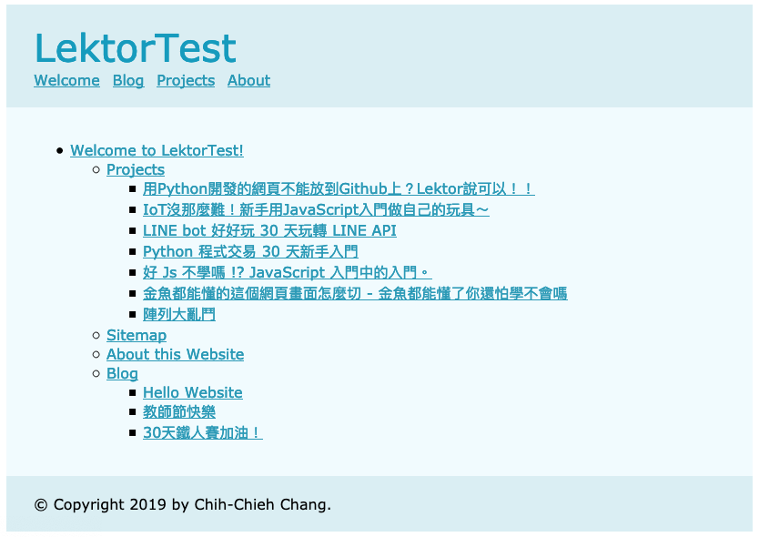

# 還在手動做網站地圖嗎？Lektor秒生成給你看！

sitemap主要分為`( html、asp、aspx、php )`及 `XML`2大格式，第1種提供給使用者參考導覽，第2種則是提供搜尋引擎，協助SEO網站優化。本篇2種都會講到!!!!!

## sitemap.xml

xml格式，在網路上都有定義規範，讓搜尋引擎能正常存取，達到SEO優化。我在網路上找了一個[比較像官方的網頁](https://www.sitemaps.org/protocol.html)，裡面有詳細提到sitempa.xml的相關規範，各位可以參考看看。

好的，接下來將直接示範如何生成sitemap.xml檔！

設定的邏輯呢，盡量還是以同樣的順序來思考：`model` > `template` > `content`。當然，每個人的思考方式都不一樣，只要能完成，你要從哪開始都沒關係，網頁開的起來就好～

在這邊，`sitemap`並不會有需要手動編輯的內容，所以不需要建立`model`來設定內容架構。所以先來看`template`：

### template

sitemap.xml規範格式範例如下：

```xml
<?xml version="1.0" encoding="UTF-8"?>

<urlset xmlns="http://www.sitemaps.org/schemas/sitemap/0.9">

   <url>

      <loc>http://www.example.com/</loc>

      <lastmod>2005-01-01</lastmod>

      <changefreq>monthly</changefreq>

      <priority>0.8</priority>

   </url>

</urlset>
```

其中除了第一行的xml定義以外，`urlset`,`url`, `loc` 這3個標籤是必須要有的。`urlset`定義`sitemap`屬性，每1`url`代表一個頁面的連結，底下都需要包含`loc`標籤。而`lastmod`, `changefreq`, `priority`這3個則是非必要的標籤。因此`template`設定如下，這邊直接命名為`sitemap.xml`：

**templates/sitemap.xml**

```xml
<?xml version="1.0" encoding="UTF-8"?>
<urlset xmlns="http://www.sitemaps.org/schemas/sitemap/0.9">
  
  <url><loc>{{ page|url(external=true) }}</loc></url>
  {{- loop(page.children) }}
  
</urlset>
```

上面的程式碼即是按照規格，先定義xml檔，再來定義sitemap資訊（urlset），接下來將網站中每一個網頁的資訊用迴圈的方式找出來，用`<url><loc></loc><url>`將網址包起來。而且每一主層跑完，會先跑該主層的子層。讓同一主層下的頁面排在一起。

看到第4行的`page|url(external=true)`，表示在.lektorproject檔案中，必須設定`url`的路徑，並設定`url_style=external`，上面的xml才能符合條件式，產出完整xml檔。因為我都在本機上面測試，所以網址直接改成ip，注意port也要加上去：

```ini
[project]
name = LektorTest
url = http://127.0.0.1:5000
url_style = external
```

### content

template完成後，需要建立content讓lektor抓得到網址。因為目標檔案為sitemap.xml，我們就在contents下建立一個sitemap.xml資料夾，並在資料夾中建立contents.lr，指定渲染對象為sitemap.xml，並設定model為none，內容如下：

**sitemap.xml/contents.lr**

```ini
_template: sitemap.xml
---
_model: none
```

如此一來就會在http://127.0.0.1:5000/sitemap.xml生成完整的sitemap.xml，是不是很方便呢！以下是我生成的sitemap.xml檔案：


## sitemap.html

另一種網站地圖就是會出現在網頁最下方，或是`網站地圖`頁面中的類型，我們這邊直接見一個新的html來呈現，想要放在網頁中的，可以直接將程式碼貼到你要的位置即可。

### template

一樣利用loop迴圈方式將主層及子層分別顯示出來：

**templates/sitemap.html**

```html

Sitemap

<ul class="sitemap">
  
  <li><a href="{{ page|url }}">{{ page.record_label }}</a>
    
      <ul>{{ loop(page.children) }}</ul>
    
  </li>
  
</ul>

```

### content

`contents.lr`檔案設定跟前面差不多，只要調整一下資料夾名稱及目標`template`檔案：

**sitemap/contents.lr**

```ini
_template: sitemap.html
---
_model: none
```

因為目標是`sitemap.html`，資料夾名稱直接取名`sitemap`；而`contents.lr`內容的`_template`則指向`sitemap.html`如此一來便大功告成！



# 團隊系列文

CSScoke - [金魚都能懂的這個網頁畫面怎麼切 - 金魚都能懂了你還怕學不會嗎](https://ithelp.ithome.com.tw/users/20112550/ironman/2623)
King Tzeng - [IoT沒那麼難！新手用JavaScript入門做自己的玩具～](https://ithelp.ithome.com.tw/users/20103130/ironman/2125)
Hina Hina - [陣列大亂鬥](https://ithelp.ithome.com.tw/users/20120000/ironman/2256) 
阿斬 - [Python 程式交易 30 天新手入門](https://ithelp.ithome.com.tw/users/20120536/ironman/2571)
Clarence - [LINE bot 好好玩 30 天玩轉 LINE API](https://ithelp.ithome.com.tw/users/20117701/ironman/2634)
塔塔默 - [用Python開發的網頁不能放到Github上？Lektor說可以！！](https://ithelp.ithome.com.tw/users/20112552/ironman/2735)
Vita Ora - [好 Js 不學嗎 !? JavaScript 入門中的入門。](https://ithelp.ithome.com.tw/users/20112656/ironman/2782)