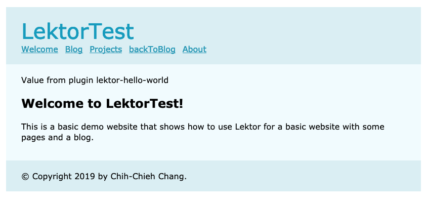

# 裝上強力的武器，Lektor外掛介紹

在前面的文章中有提到兩個外掛：`disqus`及`webpack`。本篇文章將說明如何安裝、讀取、以及開發並上架外掛。

## 安裝外掛

安裝方式有兩種，第一個是直接在`.lektorproject`中輸入外的名稱及版本：

```ini
[packages]
lektor-disqus-comments = 0.4.1
lektor-webpack-support = 0.5
```

另一種則是透過指令新增，最終也會在`.lektorproject`的檔案中加入外掛。

```
$ lektor plugin add lektor-disqus-comments
```

## 讀取外掛

若是有在`.lektorproject`輸入名稱，Lektor就會讀取外掛，但如果是正在開發中的外掛，可以在專案中建立`package`資料夾，並在資料夾中建立放入外掛，1個外掛1個資料夾。

## 開發外掛

在開發前需要先設定`LEKTOR_DEV=1`。

```
$ export LEKTOR_DEV=1
$ lektor server
```

## 建立package

如同前面說明，在`package`資料夾中建立外掛的資料夾，即可開始進行開發。Lektor也有提供指令，幫你建立外掛資料夾，通常命名為`lektor-xxxx`。像是前面提到的disqus，其外掛名稱為`lektor-disqus-comments`。以下用`lektor-hello-world`為例介紹外掛開發流程，首先執行指令，或是在`package`資料夾中建立`lektor-hello-world`資料夾：

```
$ lektor dev new-plugin
```

執行上述命令後，lektor會問你一些問題，並根據的你回答建立外掛資料夾：


以下是剛建立的外掛資料夾架構


裡面包含README.md，setup.py，及lektor_hello_world.py檔案，並幫你建立.gitignore，避免之後要push時不小心也把執行過程的檔案也上傳上去，真的是非常貼心呢！

### setup.py

看一下自動建立的setup.py長什麼樣子：

```python
import ast
import io
import re

from setuptools import setup, find_packages

with io.open('README.md', 'rt', encoding="utf8") as f:
    readme = f.read()

_description_re = re.compile(r'description\s+=\s+(?P<description>.*)')

with open('lektor_hello_world.py', 'rb') as f:
    description = str(ast.literal_eval(_description_re.search(
        f.read().decode('utf-8')).group(1)))

setup(
    author='Chih-Chieh Chang',
    author_email='haninfinity530@gmail.com',
    description=description,
    keywords='Lektor plugin',
    license='MIT',
    long_description=readme,
    long_description_content_type='text/markdown',
    name='lektor-hello-world',
    packages=find_packages(),
    py_modules=['lektor_hello_world'],
    # url='[link to your repository]',
    version='0.1',
    classifiers=[
        'Framework :: Lektor',
        'Environment :: Plugins',
    ],
    entry_points={
        'lektor.plugins': [
            'hello-world = lektor_hello_world:HelloWorldPlugin',
        ]
    }
)
```

setup.py提供lektor這個外掛要執行的資訊，讓lektor知道要怎麼樣執行這個外掛。再來看自動建立的`lektor_hello_world.py`裡面長什麼樣子吧！

### lektor_hello_world.py

這個文件為外掛的執行程式，外掛的開發程式就是寫在這裡面：

```python
# -*- coding: utf-8 -*-
from lektor.pluginsystem import Plugin

class HelloWorldPlugin(Plugin):
    name = 'lektor-hello-world'
    description = u'Add your description here.'

    def on_process_template_context(self, context, **extra):
        def test_function():
            return 'Value from plugin %s' % self.name
        context['test_function'] = test_function
```

此時執行`lektor serve`就會看到命令列在幫你安裝外掛，你也可以用`lektor plugins list`檢視目前已經安裝的外掛資訊：


## 事件監聽

lektor中的外掛執行方式以事件監聽為主，在外掛中設定的事件觸發時，啟動外掛並執行動作。例如上面建立的外掛，有設定`test_function()`，其動作會回傳一個字串：`'Value from plugin %s' % self.name`，轉換後就是`Value from plugin lektor-hello-world`。所以當我在網頁的template中加入```{{ test_function() }}```，就會在我要的位置收到回傳的資訊。如下，我在layout.html中加入，位置放在page的div區塊中，並在block上方，因此預期`Value from plugin lektor-hello-world`這一串文字會出現在所有頁面的內容上方的位置。

```html
<!doctype html>
<meta charset="utf-8">
<link rel="stylesheet" href="{{ '/static/style.css'|url }}">
<title>Welcome — LektorTest</title>
<body>
  <header>
    <h1>LektorTest</h1>
    <nav>...</nav>
  </header>
  <div class="page">
    {{ test_function() }}
    
  </div>
  <footer>
    &copy; Copyright 2019 by Chih-Chieh Chang.
  </footer>
</body>
```



成功了！！！

## 外掛還能幹嘛？

lektor中已經建置了一些常用的API，提供外掛開發使用，相關資訊可參考[這裡](https://www.getlektor.com/docs/api/plugins/)

# 團隊系列文

CSScoke - [金魚都能懂的這個網頁畫面怎麼切 - 金魚都能懂了你還怕學不會嗎](https://ithelp.ithome.com.tw/users/20112550/ironman/2623)
King Tzeng - [IoT沒那麼難！新手用JavaScript入門做自己的玩具～](https://ithelp.ithome.com.tw/users/20103130/ironman/2125)
Hina Hina - [陣列大亂鬥](https://ithelp.ithome.com.tw/users/20120000/ironman/2256) 
阿斬 - [Python 程式交易 30 天新手入門](https://ithelp.ithome.com.tw/users/20120536/ironman/2571)
Clarence - [LINE bot 好好玩 30 天玩轉 LINE API](https://ithelp.ithome.com.tw/users/20117701/ironman/2634)
塔塔默 - [用Python開發的網頁不能放到Github上？Lektor說可以！！](https://ithelp.ithome.com.tw/users/20112552/ironman/2735)
Vita Ora - [好 Js 不學嗎 !? JavaScript 入門中的入門。](https://ithelp.ithome.com.tw/users/20112656/ironman/2782)