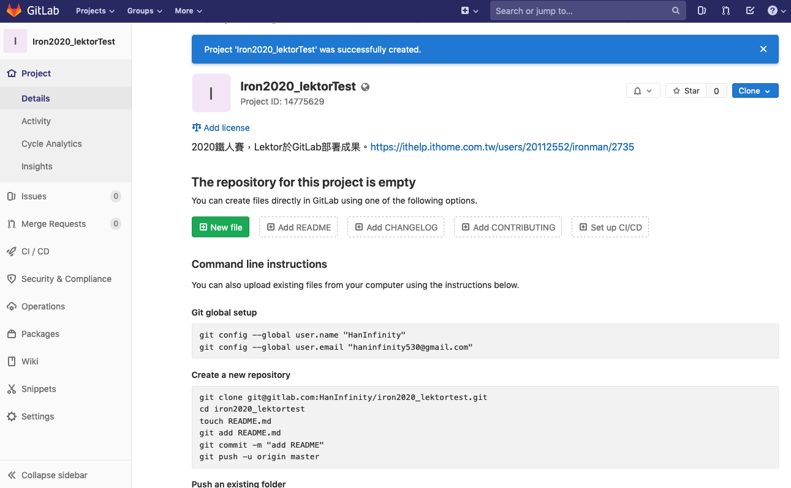
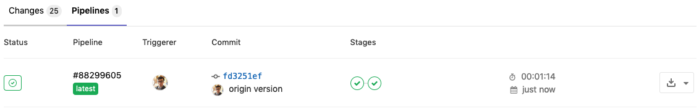
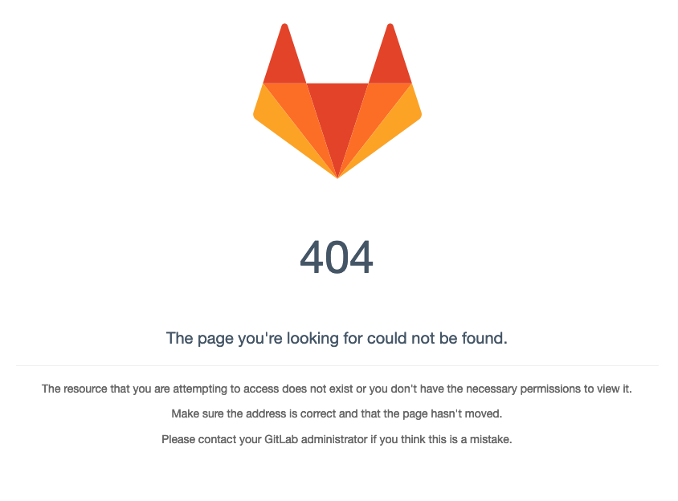
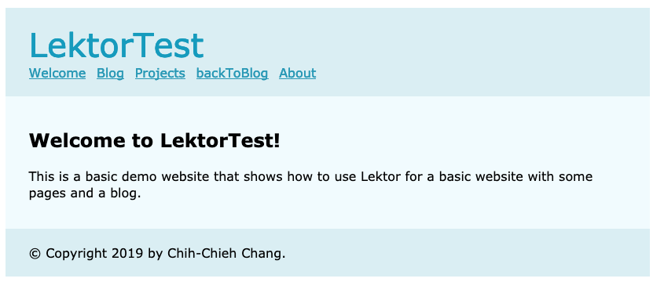

# Git界的狐狸，與Lektor也有聯盟！！

在git平台中，比較著名的Github及GitLab兩大平台，Lektor都有提供部署方法。當然除了這兩個平台，還有Bitbucket等強大的平台，只是目前Lektor尚未放置部署方法而已。GitLab的LOGO就是一隻狐狸，所以我稱它為Git界的狐狸，而Github則是Git界的貓咪（雖然腳是章魚??）。今天將先介紹GitLab部署方式，其方法會用到GitLab本身即有的ci功能。

GitLab提供GitLab Pages功能，讓使用者可以直接在資源庫中建置專屬的靜態網頁，這點與Github很像，特別的是GitLab本身便具有CI功能，不像Github必須配合Travis-CI一同使用。在建立GirLab部署時，須先設定CI，首先建立`.gitlab-ci.yml`檔案，告訴GitLab資料推上去時，希望他怎麼處理：

```yml
image: python:latest

pages:
  script:
    - pip install lektor
    - lektor build --output-path public
  artifacts:
    paths:
      - public
  only:
    - master
```

`.gitlab-ci.yml`中設定了CI安裝python最新版本，並使用pip安裝lektor套件，將專案資料建置在public資料夾，也就是GitLab預設的靜態網頁資料夾中，最後設定這些動作只在master分支使用，也就是說，網頁只會呈現master的進度，不會事先透露開發中的網頁資料。

設定完之後，不像前面的部署方式那樣，透過編輯模式直接選擇部署，而是透過push到GitLab資料庫中，讓GitLab自動幫你生成靜態網頁。兩者方法不同，但各有優缺點。ftp及rsync提供快速的部署方式，直接生成更新，GitLab及Github則是有版本控制，在更新資料上會比較好管理。

## 實際操作

接下來我將實際操作一次！！相關成果可以到https://gitlab.com/HanInfinity/iron2020_lektortest檢視。

首先建立空的專案



接著在既有的專案中建立`.gitlab-ci.yml`，並將專案推到GitLab上。

此時進入網頁就會看到CI開始在跑了


進到commit頁面檢視進度，下面是進度完成，並成功建置靜態網頁的畫面。



接著進入`Settings>Pages`取得靜態網頁的網址(https://haninfinity.gitlab.io/iron2020_lektortest)。下邊有個附註，說明第一次完成的部署可能會需要30分鐘左右才可以看到網頁。


目前看到的畫面是404，等晚一點看看是不是有成功建立。



結果過不到10分鐘，網站就生成囉～～



# 團隊系列文

CSScoke - [金魚都能懂的這個網頁畫面怎麼切 - 金魚都能懂了你還怕學不會嗎](https://ithelp.ithome.com.tw/users/20112550/ironman/2623)
King Tzeng - [IoT沒那麼難！新手用JavaScript入門做自己的玩具～](https://ithelp.ithome.com.tw/users/20103130/ironman/2125)
Hina Hina - [陣列大亂鬥](https://ithelp.ithome.com.tw/users/20120000/ironman/2256) 
阿斬 - [Python 程式交易 30 天新手入門](https://ithelp.ithome.com.tw/users/20120536/ironman/2571)
Clarence - [LINE bot 好好玩 30 天玩轉 LINE API](https://ithelp.ithome.com.tw/users/20117701/ironman/2634)
塔塔默 - [用Python開發的網頁不能放到Github上？Lektor說可以！！](https://ithelp.ithome.com.tw/users/20112552/ironman/2735)
Vita Ora - [好 Js 不學嗎 !? JavaScript 入門中的入門。](https://ithelp.ithome.com.tw/users/20112656/ironman/2782)