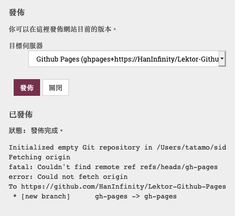
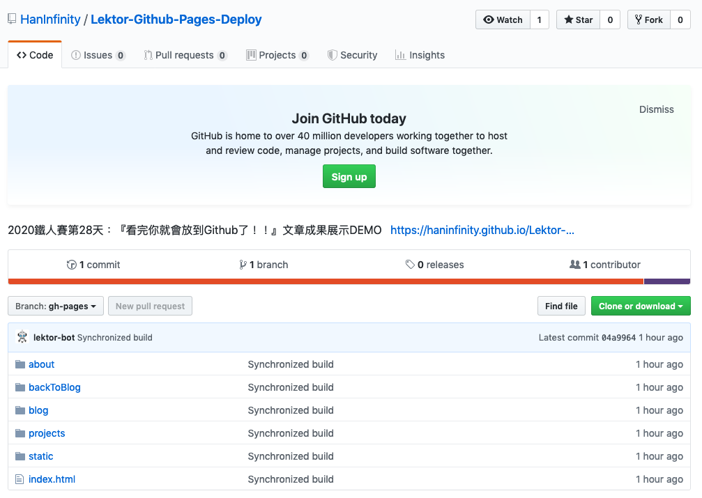
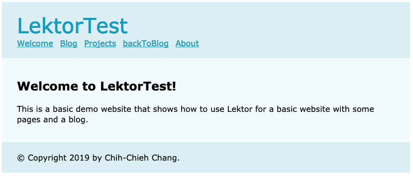

# 看完你就會放到Github了！！

Lektor 在GitHub Pages支援上比GitLab還要好一點，可以不用自己手動push上去，與前幾天提到的ftp、rsync一樣，可以直接在.lektorproject中進行設定：

```ini
[servers.ghpages]
target = ghpages://your-user/your-repository
```
其中`target`格式可分為下列兩種：

- `ghpages://username/repository`：此格式為使用ssh方式連線。

- `ghpages+https://username/repository`：此格式使用HTTPs方式連線。

以上方法均可以完成部署設定，就看你比較喜歡用ssh還是https連線。

## 實際操作

自己做做看的時間到了，首先我在github中建立一個新的專案`https://github.com/HanInfinity/Lektor-Github-Pages-Deploy`，然後在電腦這邊的.lektorproject檔案中設定github pages連線：

```ini
[servers.ghpages]
name = Github Pages
target = ghpages+https://HanInfinity/Lektor-Github-Pages-Deploy
```

然後就直接`$ lektor serve`啟動，進入編輯頁面，此時可以看到部署的選項中多了一個Github Pages可以發佈。選擇後按下發佈，看到`狀態：發佈完成。`就可以放心了，往下看會發現Lektor自動幫我在Github中建立的新專案中新增`gh-pages`分支，這個分支是github預設的靜態網頁分支。前面出現的錯誤訊息則是因為我沒有在github中建立什麼新檔案，所以無法進行fetch。



接著上去看[Github網頁](https://github.com/HanInfinity/Lektor-Github-Pages-Deploy)，可以看到資料庫中只有一個`gh-pages`分支，其中顯示的檔案就是Lektor生成的靜態網頁檔案。



接著進入Github Pages提供的網頁連結，即可看到Lektor專案生成的網頁畫面了！！



GitLab有CI，Github則有Travis-CI配合，一樣也可以幫你自動部署，生成靜態網頁。相關說明將於明天揭曉！！

# 團隊系列文

CSScoke - [金魚都能懂的這個網頁畫面怎麼切 - 金魚都能懂了你還怕學不會嗎](https://ithelp.ithome.com.tw/users/20112550/ironman/2623)
King Tzeng - [IoT沒那麼難！新手用JavaScript入門做自己的玩具～](https://ithelp.ithome.com.tw/users/20103130/ironman/2125)
Hina Hina - [陣列大亂鬥](https://ithelp.ithome.com.tw/users/20120000/ironman/2256) 
阿斬 - [Python 程式交易 30 天新手入門](https://ithelp.ithome.com.tw/users/20120536/ironman/2571)
Clarence - [LINE bot 好好玩 30 天玩轉 LINE API](https://ithelp.ithome.com.tw/users/20117701/ironman/2634)
塔塔默 - [用Python開發的網頁不能放到Github上？Lektor說可以！！](https://ithelp.ithome.com.tw/users/20112552/ironman/2735)
Vita Ora - [好 Js 不學嗎 !? JavaScript 入門中的入門。](https://ithelp.ithome.com.tw/users/20112656/ironman/2782)