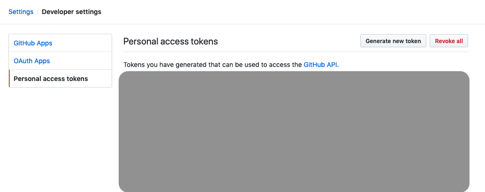
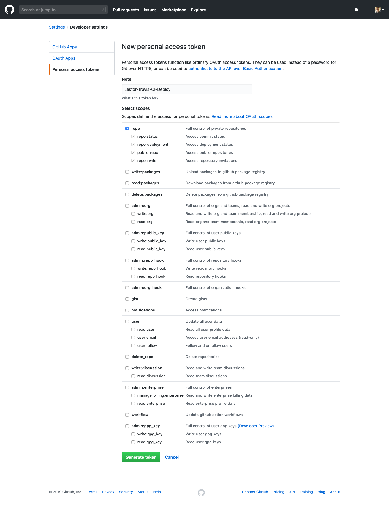
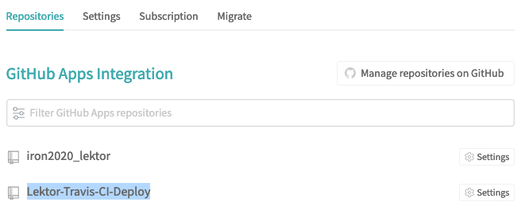
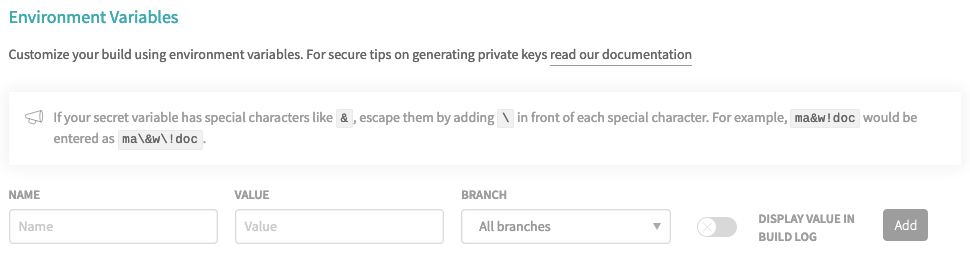
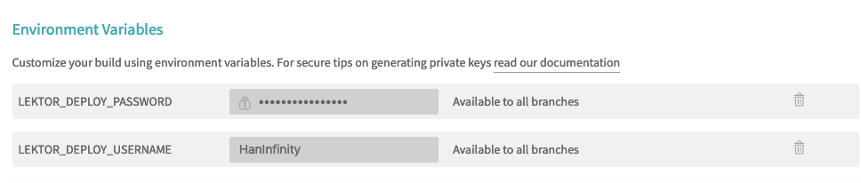
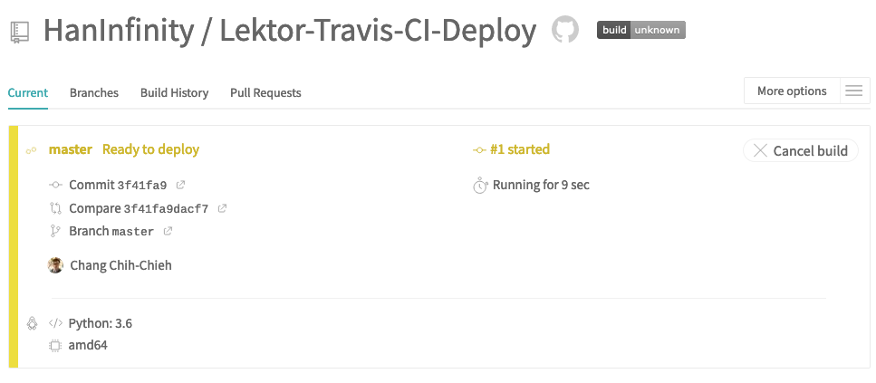
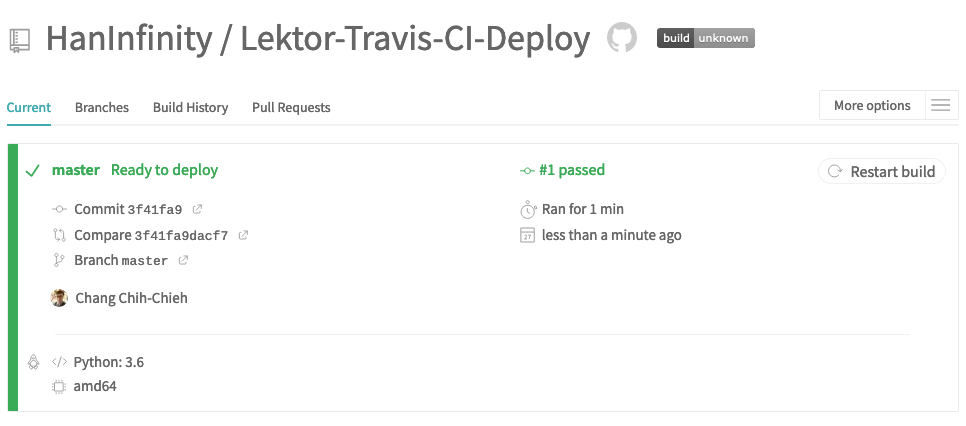
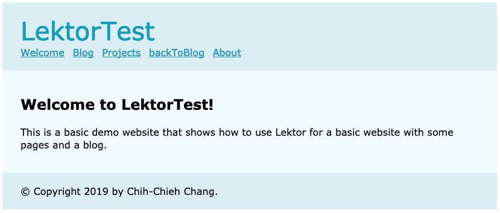

# 他，是Github的好夥伴

說的其實就是`Travis-CI`，提供github持續整合專案的平台。設定Travis-CI部署的方式共分4個步驟：

1. `.travis.yml`
2. `.lektorprotject`
3. `Travis-CI`參數
4. Git push

## .travis.yml

使用方法與前面提到的GitLab設定類似，需要先建立一個檔案，以便推進度到Github時，讓Travis-CI知道他應該要怎麼做，檔案名稱為`.travis.yml`，以下為檔案內容：

```yml
language: python
python: 3.6
cache:
  directories:
    - $HOME/.cache/pip
    - $HOME/.cache/lektor/builds
install: "pip install Lektor"
script: "lektor build"
deploy:
  provider: script
  script: "lektor deploy ghpages"
  on:
    branch: master
```

跟GitLab不同的是，Travis-CI與Github在不同的平台。GitLab本身就有CI功能，所以可以直接設定輸出資料夾位置，但是Travis-CI在設定的時候需另外提供帳號及訪問憑證資訊，讓他可以將專案生成靜態資料後部署到Github中。

上面的程式碼中，除了設定Travis-CI安裝python及Lektor，並使用`lektor build`生成靜態網頁，最後透過`lektor deploy ghpages`將靜態網頁部署到Github Pages預設分支`ghpages`，並限定在master分支更新時才進行。除此之外，檔案中也建立了`cache`，可減少之後更新網頁時生成的時間。

## .lektorprotject

與上一篇的GitHub設定格式一樣：

```ini
[servers.ghpages]
target = ghpages+https://username/repository
```

## Travis-CI 參數

首先在GitHub建立空資源庫(我建立的名稱為`Lektor-Travis-CI-Deploy`)，然後進入帳號設定（網頁右上角點擊頭像，選擇`Settings`），進入`Developer settings`。



點擊`Generate new token`，設定名稱並指勾選`repo`選項，然後拉到最下面按`Genrate token`：



接著網頁中會出現生成的憑證，等一下會用到，因為重新整理後就無法再看到憑證，所以先複製到空白記事本或其他地方。如果真的忘記了，那就只能重新生成憑證了。

接著進入[Travis-CI](https://travis-ci.com)，設定與GitHub帳號連動，並選擇指定的資源庫，若在Travis-CI網頁中有顯示該資源庫，就代表成功啟動了。



點擊資源庫名稱右邊的`Settings`，找到`Environment Variables`的區塊設定參數：



設定`LEKTOR_DEPLOY_USERNAME` 及 `LEKTOR_DEPLOY_PASSWORD`，`LEKTOR_DEPLOY_USERNAME`為你的GitHub使用者名稱，`LEKTOR_DEPLOY_PASSWORD`為剛剛在GitHub中取得的憑證，注意設定憑證資訊時不要開啟`Display value in build log`。完成後應該會看到類似下圖的畫面。



## Git push

接下來就將專案推上GitHub上吧！！推上去之後直接開啟Travis-CI網頁，你就會看到開始執行靜態網頁生成了！！



成功後就會變成綠色，接下來就可以看成果～



[成果網頁](https://haninfinity.github.io/Lektor-Travis-CI-Deploy/)



寫完這一篇，就算已經成功寫完此次鐵人文的目標！！明天將進行總結！！

# 團隊系列文

CSScoke - [金魚都能懂的這個網頁畫面怎麼切 - 金魚都能懂了你還怕學不會嗎](https://ithelp.ithome.com.tw/users/20112550/ironman/2623)
King Tzeng - [IoT沒那麼難！新手用JavaScript入門做自己的玩具～](https://ithelp.ithome.com.tw/users/20103130/ironman/2125)
Hina Hina - [陣列大亂鬥](https://ithelp.ithome.com.tw/users/20120000/ironman/2256) 
阿斬 - [Python 程式交易 30 天新手入門](https://ithelp.ithome.com.tw/users/20120536/ironman/2571)
Clarence - [LINE bot 好好玩 30 天玩轉 LINE API](https://ithelp.ithome.com.tw/users/20117701/ironman/2634)
塔塔默 - [用Python開發的網頁不能放到Github上？Lektor說可以！！](https://ithelp.ithome.com.tw/users/20112552/ironman/2735)
Vita Ora - [好 Js 不學嗎 !? JavaScript 入門中的入門。](https://ithelp.ithome.com.tw/users/20112656/ironman/2782)