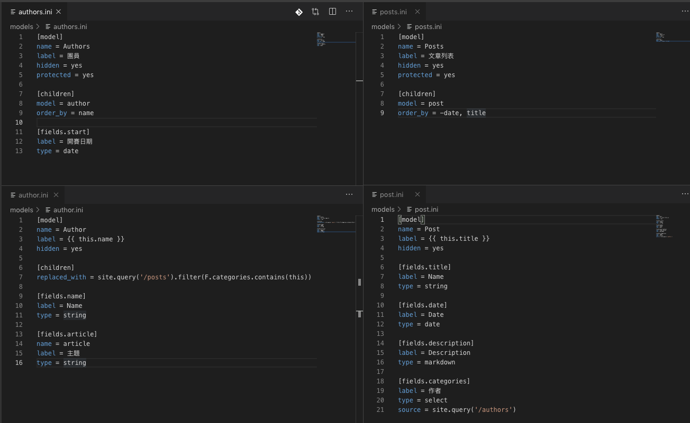
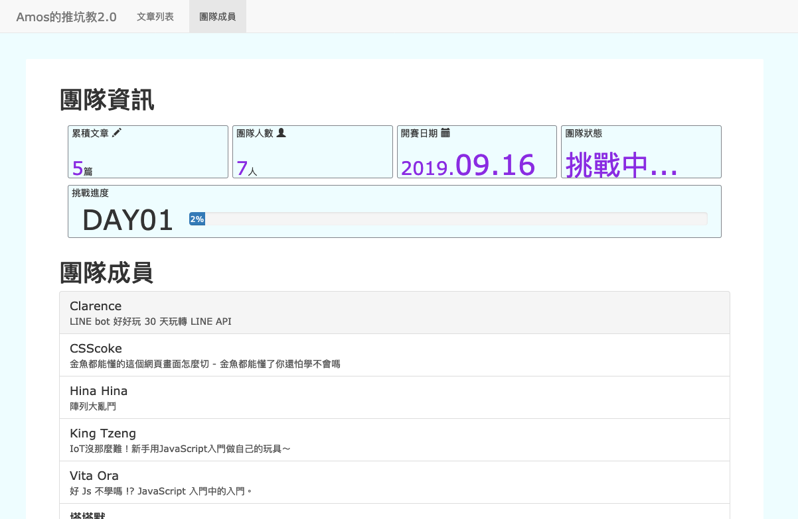

# 30天後的挑戰

繼完成鐵人賽後，開始了一段時間的休息，最近都是躺下去醒來就天亮的生活，不知道是工作還是鐵人賽，抑或是純粹天氣轉涼比較好睡(?)

由於鐵人賽完成後，原本想要規劃建立一個網站作為成果，來個完美Ending。但在調整畫面時，發現CSS的問題還是很大，所以先補救了Amos的金魚系列課程，看到一半，但也把我預想的版面完成了，多虧Amos老師的金魚系列，真的輕鬆易懂沒壓力！

廢話說完了，進入正題吧。30天後的挑戰，想建立一個類似鐵人賽的網站。可以在編輯區建立作者，於新增文章時也可選擇作者，在網頁則顯示文章列表及團隊成員列表。文章列表顯示所有文章，而團隊成員列表則是參考鐵人賽頁面，顯示目前團隊成員、文章數量等等。在文章列表中還可以點選單一作者顯示該作者撰寫的文章。

## 建立架構

上面有關單一作者顯示該作者撰寫的文章，可以參考Day12的文章，我在專案中建立4個model，分別是有關作者的`author`及`authors`(從project-category及project-categories修改)，有關文章的`post`及`posts`(從project及projects修改)。

程式碼均直接修改範例的內容，所以我這邊就直接上圖，程式碼的部分也可以到github上去看。



有修改的部分，在authors中增加開賽日期欄位，用於顯示團隊成員列表中。另外也在projects中的category欄位類別，原本是`checkbox`，屬於可選複數的選項，因為這邊只會選單一作者，所以我改成`select`：

```ini
[fields.categories]
label = 作者
type = select
source = site.query('/authors')
```

接著就是在編輯模式中建立作者及文章內容，並建立templates，就完成了網站！



說著好像很簡單就完成了，其實裡面還有一些重點沒有提到，各位可以到[Github](https://github.com/HanInfinity/iron2020_Lektor_Day30_Performance)看程式碼，成果網站可以到[成果網站](https://haninfinity.github.io/iron2020_Lektor_Day30_Performance/)。有任何問題的話歡迎在github或是下方回應，但在下面會比較晚回應就是了。