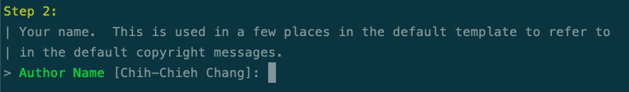
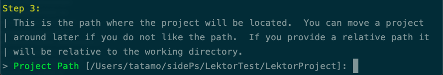

被說快不是你的權利，讓Lektor陪你......
===

## 建立新專案

輸入以下命令即可建立專案資料。
`$ lektor quickstart`
此時終端機中會引導你輸入相關資訊，建立專案。

第一步會讓你輸入專案名稱

第二步需要輸入作者名稱

接下來要確認專案的位置

第四步確認是否要建立基本的部落格模組，我這邊選`是`，才能看到更完整的範例網站長什麼樣子。

最後會要你確認是否要建立專案，勇敢地按下去，專案就出來了！！

## 本機端測試專案

在專案的資料夾中輸入以下命令，即可檢視成果。
`$ lektor server`

看到類似以下畫面即代表成功建立囉！

在終端機中點網址或在瀏覽器輸入`http://127.0.0.1:5000/`，看一下剛剛建立的專案長什麼樣子吧！

首頁為`Welcome`，網頁中還有`Blog`、`Projects`、`About`頁面，右上角有個鉛筆個圖示，點進去後則進入編輯的畫面。

裡面除了可以編輯、預覽、刪除，還可以直接新增頁面、子頁面以及附件等功能，這真的是靜態網頁可以做到的嗎？！

## 建立靜態網頁檔案

既然要將專案放到github上，首先要將專案變為靜態網頁的格式，讓github pages讀得懂這個專案。使用以下指令：

`$ lektor build`

這樣就會建立一個完整的靜態網站資料夾，但你應該會發現......根本不知道檔案在哪！！

使用下列指令就可以找到轉換為的靜態檔案放在哪裡：

`$ lektor project-info --output-path`

像我的電腦是放在：`/Users/tatamo/Library/Caches/Lektor/builds/6c1377bc5ee9f5288d66ae257755b225`，將這個資料夾裡面的檔案放到github上，就可以使用GitHub pages檢視網站內容囉！！

經過`lektor build`產生的網頁不會有右上角的筆（編輯模式）出現，所以可以安心地將網頁發布到網路上，以免被人修改。
